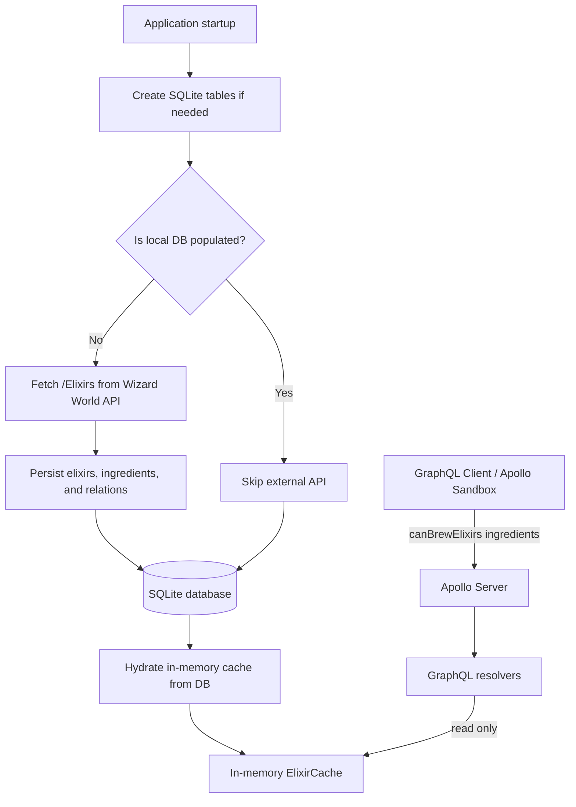
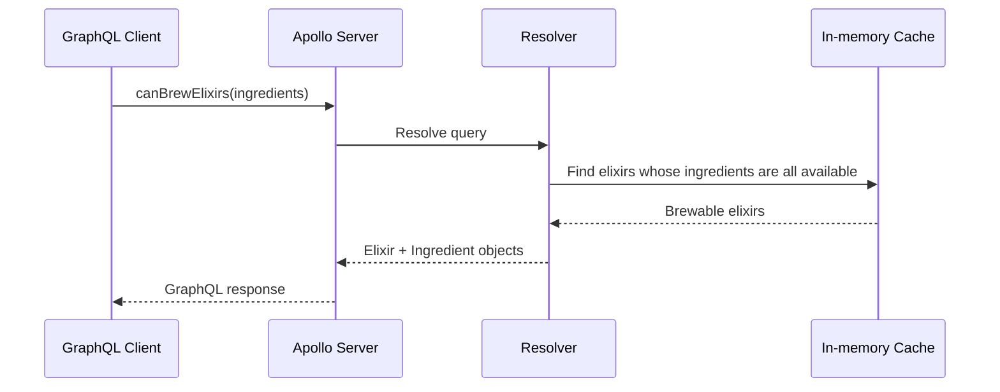
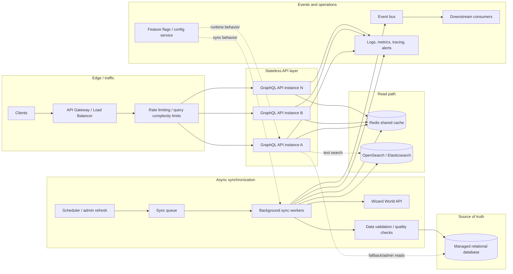

# Consumer Edge Challenge — Wizard World GraphQL API

GraphQL service that answers which Harry Potter elixirs can be brewed from a given inventory of ingredients. Data is bootstrapped from the [Wizard World API](https://wizard-world-api.herokuapp.com), persisted in SQLite, and served from an in-memory cache on startup.

## Requirements

- **Node.js** 20+ (Docker image uses Node 24)
- **npm** (dependencies install via `npm ci` / `npm install`)

## Quick start

```bash
npm install
npm run build
npm start
```

The server listens on **http://localhost:4000**. Open the Apollo Sandbox at that URL to run queries.

### Docker

```bash
docker compose up --build
```

The database file is stored in the `wizard_db_data` volume at `/app/data/wizard.db` inside the container.

## Deployment

If a reviewer does not want to run the project locally with `npm start`, the fastest path is to deploy the Docker image to a hosted container platform.

This repo includes `render.yaml`, which deploys the Dockerfile as a Render web service and mounts a persistent disk at `/var/data` for SQLite.

Render setup:

1. Push this repository to GitHub.
2. In Render, choose **New +** -> **Blueprint**.
3. Select this repo and confirm the `render.yaml` configuration.
4. Wait for the Docker build and first startup bootstrap.
5. Open the generated Render URL; Apollo Sandbox should be available at the service root.

Expected effort and cost:

- **Render Blueprint** — Usually around **30-60 minutes** once the repo is pushed. A service with persistent disk typically requires a paid instance/disk; for a short demo, the monthly cost is usually low.
- **Important note** — The current SQLite database is file-based. A Render disk is enough for this demo, but production should use a managed relational database and stateless API containers.

## Tests

```bash
npm test
```

Tests use an in-memory SQLite database (`NODE_ENV=test`). External API calls are mocked in unit/integration tests where bootstrap is exercised.

## GraphQL usage

Example query:

```graphql
query Brewable($inventory: [String!]!) {
  canBrewElixirs(ingredients: $inventory) {
    id
    name
    effect
    ingredients {
      name
    }
  }
}
```

Variables:

```json
{
  "inventory": ["Fluxweed", "Knotgrass"]
}
```

Concrete example:

```graphql
query TestPolyjuicePotion {
  canBrewElixirs(ingredients: [
    "A bit of the person one wants to turn into",
    "Boomslang skin",
    "Fluxweed",
    "Knotgrass",
    "Lacewing flies",
    "LEECHES",
    "Powdered bicorn horn"
  ]) {
    id
    name
    effect
    ingredients {
      name
    }
  }
}
```

An elixir is returned only when **every** required ingredient is present in the inventory (after normalization: trim, lowercase, collapsed whitespace).

## Approach

1. **Startup** — `initDatabase()` creates SQLite tables if needed.
2. **Bootstrap** — If the `elixirs` table is empty, fetch `/Elixirs` from the Wizard World API (with retries), persist elixirs, ingredients, and relations in a transaction, then commit.
3. **Subsequent startups** — If data already exists, bootstrap skips the external API.
4. **Cache** — `ElixirCache.hydrate()` loads all elixirs and ingredients from the database into memory.
5. **Queries** — `canBrewElixirs` reads only from the in-memory cache (no DB or HTTP per request).

## Architecture

### Current implementation



Runtime requests are intentionally simple: GraphQL queries do not call the external API or hit SQLite. They read from the hydrated in-memory cache. The only time the Wizard World API is contacted is during startup when the local database has not been populated yet.

### Runtime query path



### Future scalable architecture

This is not implemented for the code test, but it is the direction I would take if the service needed to handle many instances, frequent data refreshes, or millions of requests.



At that scale, startup would no longer block on external synchronization. API instances would remain stateless, Redis would provide a shared low-latency cache, workers would refresh data asynchronously through a queue, and events would make changes visible to other systems without coupling them directly to the GraphQL service. OpenSearch/Elasticsearch would only be useful if the product evolved into richer text search across elixir names, effects, characteristics, ingredients, inventors, or fuzzy/autocomplete use cases; it would be unnecessary for the current `canBrewElixirs` lookup.

Additional platform services I would consider:

- **Rate limiting and GraphQL query complexity limits** to protect the API from abusive or unexpectedly expensive requests.
- **Feature flags / dynamic configuration** to roll out new matching algorithms, cache behavior, refresh strategies, or schema changes gradually.
- **Data validation / quality checks** before writing synchronized data, especially because this service depends on an external API.
- **Secrets management** for API keys, database credentials, and operational configuration.
- **Backup and restore strategy** for the production database.

## Assumptions

- Brewability means the user has **all** ingredients listed for that elixir (set containment).
- Ingredient names are matched case-insensitively after trimming and normalizing whitespace.
- Elixirs with no ingredients are not considered brewable.
- SQLite is sufficient for persistence; no migrations or production-grade ORM.
- The external API response shape matches Wizard World (`ingredients[].name`).

## Trade-offs

- **SQLite over a production database** — The challenge asks for a simple persistence layer, so SQLite keeps setup and review friction low. A production version would use a managed relational database with migrations.
- **In-memory cache over Redis** — The dataset is small and loaded once on startup, so local memory is enough for this exercise. Redis becomes useful when multiple API instances need a shared cache.
- **Startup bootstrap over background sync** — Fetching on first startup keeps the implementation easy to reason about. At scale, synchronization should move to a worker/queue so API startup is independent from external API availability.
- **Small GraphQL schema over full API parity** — The service exposes the fields needed for the problem (`Elixir`, `Ingredient`, and brewability). Fields like difficulty, inventors, and manufacturer could be added later if required.
- **Ingredient name as identity** — Ingredients are matched by normalized name because the user supplies names in the query. Persisting external ingredient IDs would be a future improvement for stronger data lineage.

## Project layout

| Path | Role |
|------|------|
| `src/index.ts` | Apollo Server startup |
| `src/services/bootstrap.ts` | First-run sync from external API |
| `src/cache/elixirCache.ts` | In-memory cache and brew logic |
| `src/database/db.ts` | SQLite connection and schema |
| `src/graphql/` | Schema and resolvers |

## Known limitations & future work

The implementation intentionally keeps the persistence and caching layers simple for the scope of the code test. If this service needed to grow beyond the exercise, these are the areas I would tackle next:

- **Refresh strategy** — There is no manual or scheduled re-sync from the Wizard World API. I would add an explicit refresh path, with locking/idempotency so two refreshes cannot race.
- **Cache invalidation** — The cache is hydrated once at startup. For a larger system, I would move cache state to Redis or another shared cache so multiple server instances can stay consistent.
- **Background work** — API refreshes currently happen during startup. At scale, I would move external synchronization into a background worker using a queue (for example BullMQ, SQS, or similar), then publish completion/failure events.
- **Event-driven updates** — If other consumers needed elixir or ingredient changes, I would emit domain events after successful syncs instead of coupling those consumers to this service.
- **GraphQL surface** — Only `canBrewElixirs` is exposed. Future queries could include all elixirs, all ingredients, search/filtering, pagination, and single-elixir lookup.
- **Persistence** — SQLite is enough for the challenge. For production, I would use a managed relational database, migrations, stricter constraints, and explicit `PRAGMA foreign_keys = ON` if SQLite remained in use.
- **Configuration** — Port and API base URL are hard-coded. I would move them to validated environment variables.
- **Observability** — Structured logs, metrics, tracing, and a `/health` endpoint would make the service easier to operate.
- **Error handling** — GraphQL errors could be mapped more explicitly, especially around bootstrap and external API failures.
- **Production controls** — Rate limiting, query complexity limits, feature flags, secrets management, and data quality checks would be needed before exposing this publicly.

## AI tools

AI assistants (e.g. Cursor) were used to help with code review, test planning, and drafting this README. Design choices, implementation, and test runs were reviewed manually.
